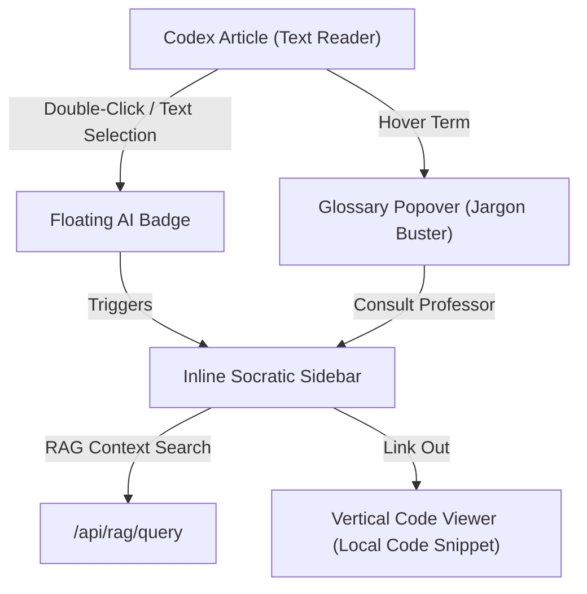

# 06 · Technical Audit & Creative Restructuring Spec

This document details the deep technical audit of **Software Universe** and outlines the creative architectural enhancements required to make it an elite, beginner-friendly platform for learning system engineering.

---

## 1. Executive Summary & Audit of Current State

The goal of Software Universe is to teach system design through the learner's own codebase (**Burger Farm**). Currently, the codebase consists of:
*   **The Codex (`/codex/*`)**: A markdown-based textbook reader with static text layouts.
*   **The Simulator (`/simulator/*`)**: A set of sandboxed, independent React widgets (consensus simulators, scaling sliders).
*   **The RAG Engine (`/api/rag/*`)**: An endpoint connected to a local vector store (markdown/HTML files) that uses LLMs (OpenRouter/OpenAI) to answer Socratic questions.

### 🔴 Key Friction Points for Beginners
1.  **The "Beginner Cliff" (Vocabulary Overload)**:
    When reading about *retry storms* or *idempotency*, a beginner gets stuck. The static text forces them to leave their reading flow to search the term elsewhere, breaking their cognitive momentum.
2.  **Disconnected Dimensions (Horizontal vs. Vertical)**:
    *   *Horizontal learning* is understanding how services communicate (e.g. Frontend $\rightarrow$ Load Balancer $\rightarrow$ Backend $\rightarrow$ Database).
    *   *Vertical learning* is understanding how a concept is implemented in code (e.g. how Stripe's idempotency maps to `apps/backend/src/middleware/idempotency.js`).
    Currently, the simulators show horizontal flows (e.g., order journeys) but do not connect them down to the real codebase files (vertical).
3.  **RAG Disconnection**:
    The Socratic assistant is isolated. It requires users to manually copy-paste or type queries into the RAG drawer or Q&A sidebar rather than allowing immediate in-context interaction.

---

## 2. Creative Enhancements & Architectural Specs

To transform the app into an interactive workspace, we propose three core features:



### Feature A: Context-Preserving Selection Q&A (Floating Socratic helper)
*   **Concept**: When reading any textbook article, if the user highlights or double-clicks any text, a small floating "Sparkle" badge appears near their cursor.
*   **Interaction**: Clicking the badge slides open the right-hand panel, pre-populates the Socratic chat input with the selected text, and automatically triggers the RAG lookup.
*   **Benefit**: Zero context switching. The user gets a full Socratic explanation of the highlighted phrase while retaining their exact scroll position and reading focus.

### Feature B: Interactive Glossary with Code Bridges
*   **Concept**: Upgrade the existing [Term.jsx](file:///c:/Desktop/Software%20Universe/components/Term.jsx) component to handle dynamic codebase integration.
*   **Interaction**:
    *   Hovering over a dotted-underlined term (e.g., `idempotency keys`) shows a quick floating tooltip.
    *   The tooltip contains two action items:
        1.  **"Grill AI Professor"**: Automatically triggers a detailed RAG query for that concept.
        2.  **"Inspect Code"**: Opens a split-pane code viewer showing the real implementation file in their Burger Farm repo (e.g. `apps/backend/src/middleware/idempotency.ts`).

### Feature C: Horizontal-to-Vertical Topology Mapping
*   **Concept**: A visual system diagram that lets users switch between *Flow Mode* (horizontal service layout) and *Code Mode* (vertical folder tree).
*   **Interaction**:
    *   Clicking a service node in the system diagram (e.g., the *Express API Gateway*) animates the request path (horizontal).
    *   Double-clicking the node pivots the UI to reveal the specific code files, middlewares, and databases involved in handling that request (vertical).

---

## 3. Implementation Plan & Restructuring Recipe

To implement these features cleanly, we will adapt our key components:

### 1. Codex Selection Interceptor
We will modify [SplitPaneViewer.jsx](file:///c:/Desktop/Software%20Universe/components/SplitPaneViewer.jsx) and [TechArticle.jsx](file:///c:/Desktop/Software%20Universe/components/TechArticle.jsx) to listen for text selections:
```javascript
const handleTextSelection = () => {
  const selection = window.getSelection();
  const text = selection.toString().trim();
  if (text.length > 1 && text.length < 100) {
    const range = selection.getRangeAt(0);
    const rect = range.getBoundingClientRect();
    setSelectionCoords({ top: rect.top + window.scrollY - 30, left: rect.left + window.scrollX });
    setSelectedText(text);
  } else {
    setSelectedText("");
  }
};
```

### 2. Floating Badge & AI Trigger
Inject a floating button styled in the "Warm Farm" design system:
```jsx
{selectedText && (
  <button
    style={{ position: "absolute", top: selectionCoords.top, left: selectionCoords.left }}
    className="floating-ai-badge"
    onClick={() => triggerSocraticQuery(selectedText)}
  >
    ✨ Ask Professor
  </button>
)}
```

### 3. Socratic Context Preservation
When the search triggers, the Socratic Q&A tab in the right pane will:
1.  Focus the Q&A tab automatically.
2.  Prepend a system prompt to the query: `"Explain the term '[text]' as used in the context of [article title]..."`.
3.  Load references inline without resetting the user's scroll on the left textbook pane.
